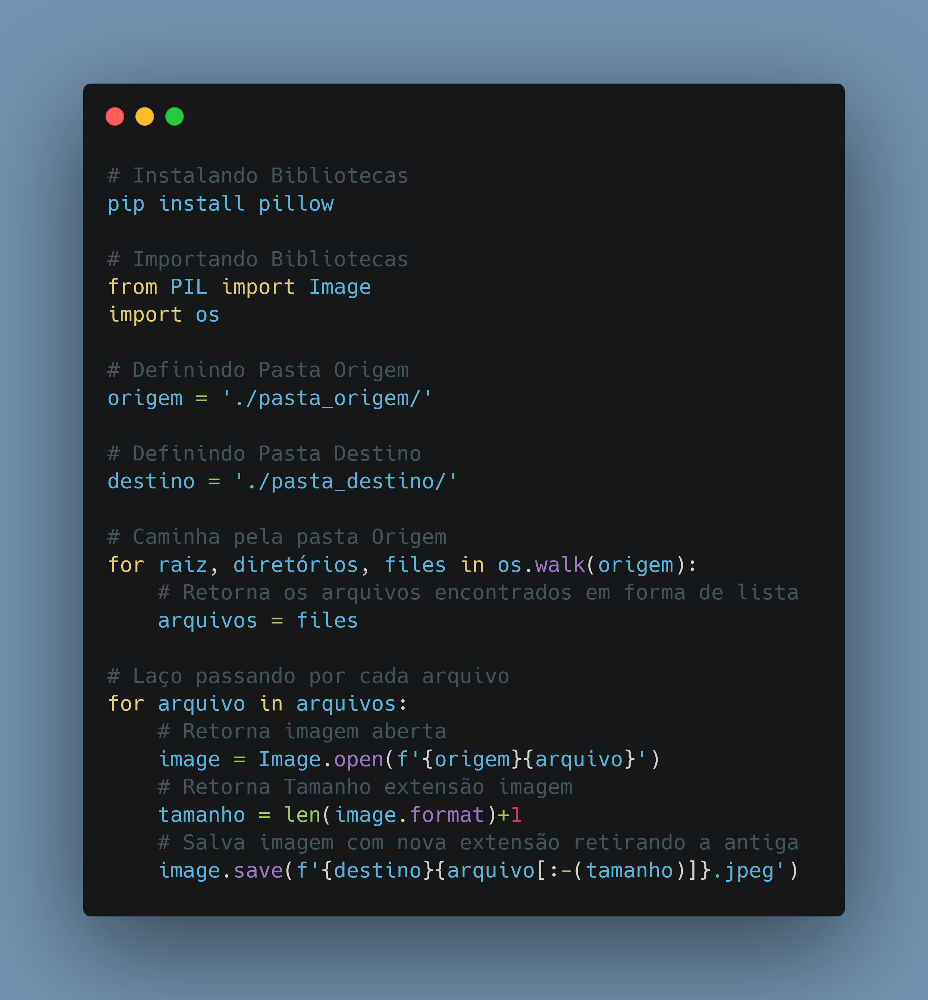

# Dia 02

## Script Post

Como Consumir API's (Públicas) de maneira fácil em Python e converter em Data Frame Pandas.

Perfil Github: https://github.com/kilerhg

Link Repositório: https://github.com/kilerhg/linkedin_publics

Link Portfólio: https://lucasnunes.me

## Screenshot

