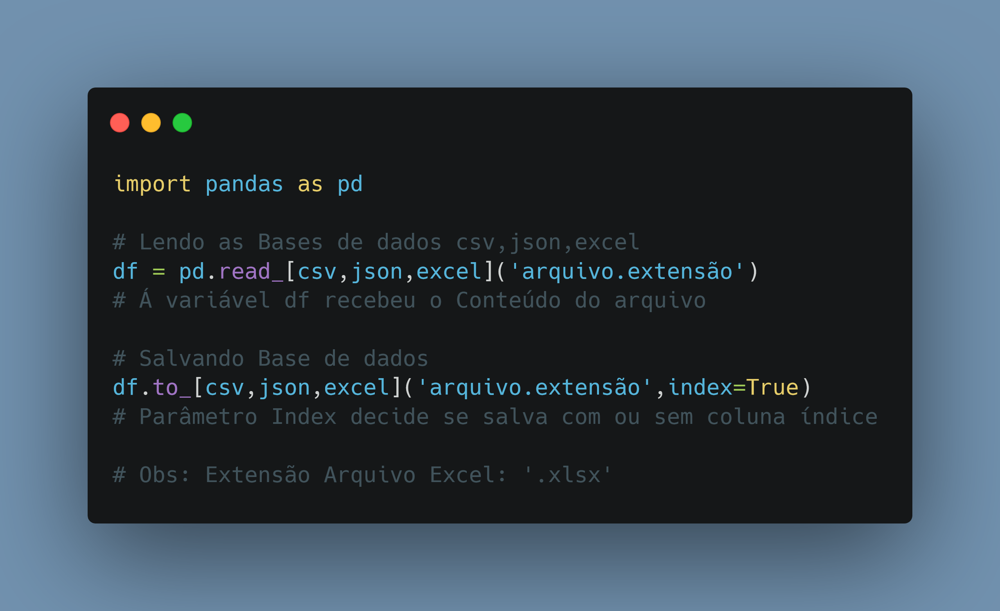

# Dia 03

---
## Script Post

🐍 Como Ler e Salvar Base de dados(csv,json,excel) de maneira fácil em Python, com a biblioteca Pandas.

Perfil GitHub: https://github.com/kilerhg
Link Repositório: https://github.com/kilerhg/linkedin_publics
Link Portfólio: https://lucasnunes.me

#python #pandas #networking #data

---

## Screenshot

