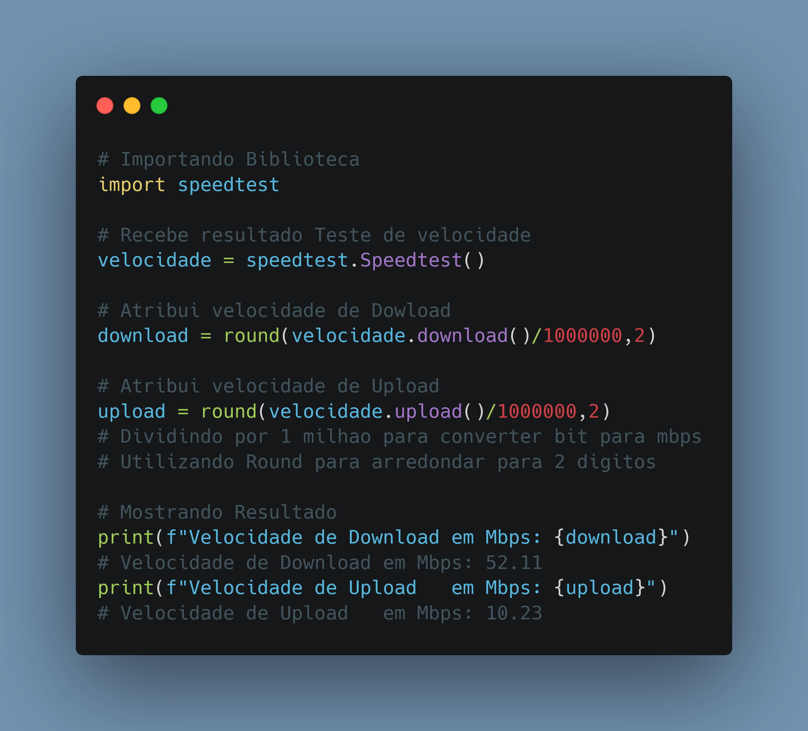

# Dia 03

---
## Script Post

🐍 Como ver sua velocidade de internet (Download, Upload) de maneira simples e fácil em Python. Com a Biblioteca speedtest

Link Repositório: https://github.com/kilerhg/linkedin_publics
Link Biblioteca: https://pypi.org/project/speedtest-cli/

Perfil GitHub: https://github.com/kilerhg
Link Portfólio: https://lucasnunes.me

#python #networking #data

---

## Screenshot

