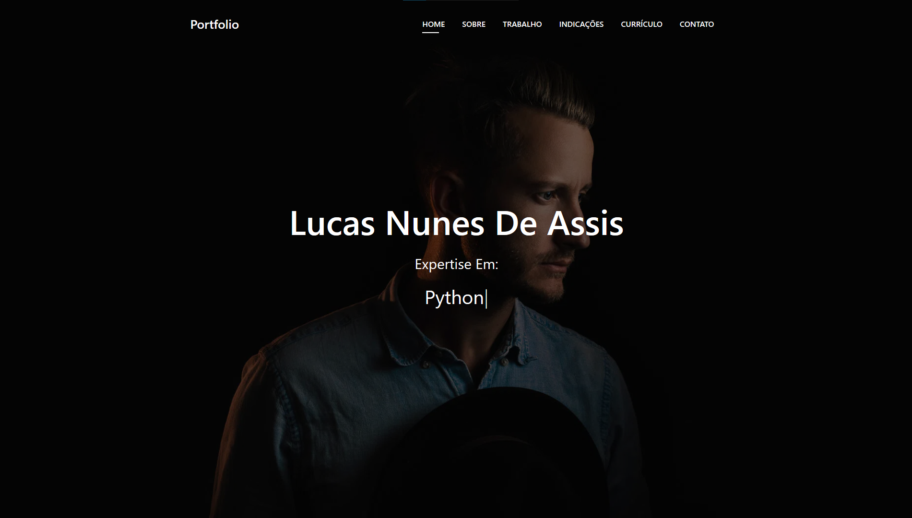

# Dia 05

---
## [Link Linkedin Post](https://www.linkedin.com/posts/lucasnunesdeassis_meu-portfolio-activity-6790348790365777920-N37x)
---
## Script Post

📌 Olá hoje venho mostrar meu Portfólio, Feito com template BootstrapMade(Link abaixo), de forma totalmente gratuita (Com exceção do domínio personalizado que é opcional), caso desejem um tutorial do código HTML até como enviar para nuvem, comentem abaixo.

Link Portfólio: https://lucasnunes.me

Link Repositório: https://github.com/kilerhg/Portifolio

Link BootstrapMade: https://bootstrapmade.com/

Perfil GitHub: https://github.com/kilerhg

#networking #data #html #git #github #Portfólio

---

## Screenshot

## Bibliografia

[PngToPdf](https://png2pdf.com/)
