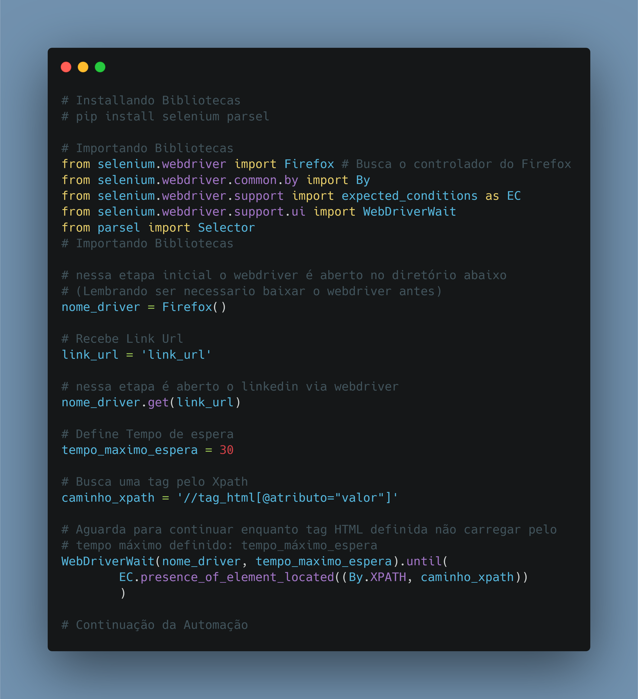

# Dia 06

---
## [Link Linkedin Post]()
---
---
## Script Post

🤖 Como fazer o Selenium aguardar uma tag html ser carregada, para continuar a automação, Utilizando Condição esperada.

❓ A condição esperada, Irá realizar um laço até a tag html definida ser achada, neste momento a automação continua, caso não for encontrada ele retorna erro.

ℹ️ Link Repositório: https://github.com/kilerhg/linkedin_publics
ℹ️ Link Biblioteca: https://selenium-python.readthedocs.io/

ℹ️ Perfil GitHub: https://github.com/kilerhg
ℹ️ Link Portfólio: https://lucasnunes.me

#python #networking #data #automação #selenium #datascience

---

## Screenshot

