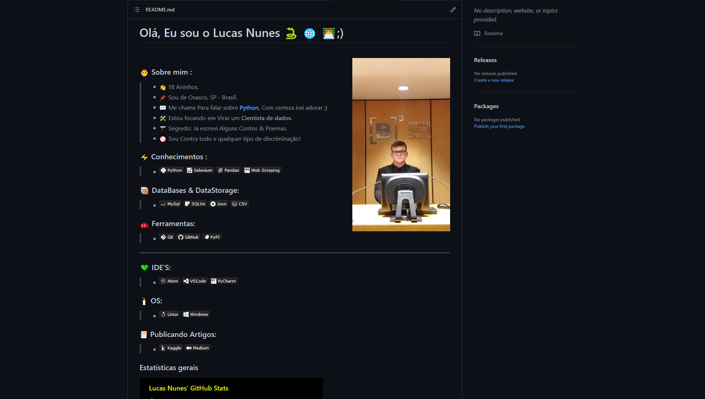

# Dia 07

---
## [Link Linkedin Post](https://www.linkedin.com/posts/lucasnunesdeassis_doc-activity-6791046170782289920-AUYs)
---
---
## Script Post

📌 Olá hoje venho mostrar meu Perfil do GitHub, que é uma forma ótima de passar a mensagem sobre você de maneira objetiva.

ℹ️ Perfil GitHub: https://github.com/kilerhg
ℹ️ Link Repositório: https://github.com/kilerhg/kilerhg#readme

❓ Links úteis Sobre:

ℹ️ Link Como criar: https://www.makeuseof.com/customize-your-github-profile-with-a-readme/
ℹ️ Link Guia MarkDown: https://www.markdownguide.org/
ℹ️ Link Ideias: https://mytrashcode.com/github-profile-readme-examples

‼️ Onde me Encontrar

ℹ️ Link Portfólio: https://lucasnunes.me

#networking #data #personal #markdown #github #readme

---

## Screenshot

