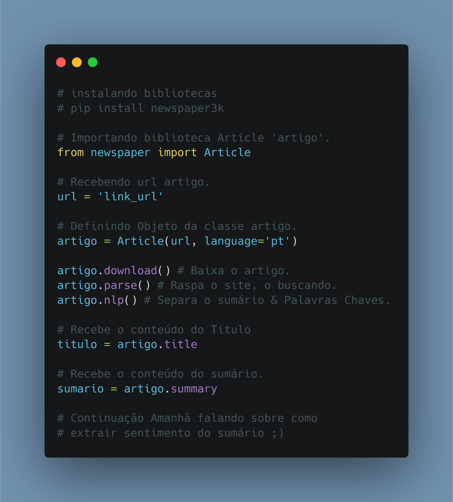

# Dia 08

---
## [Link Linkedin Post](https://www.linkedin.com/posts/lucasnunesdeassis_python-networking-data-activity-6791367553399693312-7hZS/)
---
---
## Script Post

🔎🐍 Como buscar um artigo, noticia e separar Sumário & outras informações com Python & newspaper.

❓  A Biblioteca newspaper é especializada em raspagem de dados de noticias ou artigos, retornando informações como titulo, conteúdo, data & ETC.

ℹ️ Link Repositório: https://github.com/kilerhg/linkedin_publics
ℹ️ Link Biblioteca: https://newspaper.readthedocs.io/en/latest/user_guide/quickstart.html?
ℹ️ Link Repositório Biblioteca: https://github.com/codelucas/newspaper

ℹ️ Perfil GitHub: https://github.com/kilerhg
ℹ️ Link Portfólio: https://lucasnunes.me

#python #networking #data #webscraping #newspaper #datascience

---

## Screenshot

