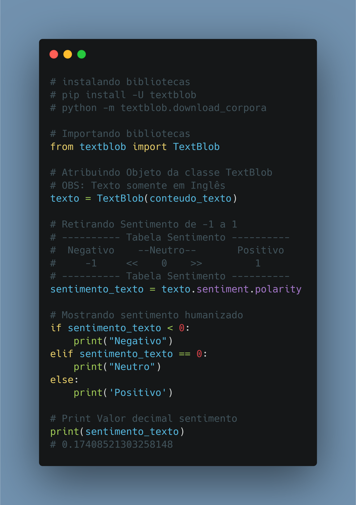

# Dia 09

---
## [Link Linkedin Post](https://www.linkedin.com/posts/lucasnunesdeassis_python-networking-data-activity-6791777477090959360-yH3o)
---
---
## Script Post

❤️ Como fazer análise de sentimento de texto de maneira fácil em Python com TextBlob.

❓ TextBlob é uma Biblioteca com foco em desmembramento de textos e análise de sentimento, se dando muito bem em conjunto com NLTK & pattern.

ℹ️ Link Repositório: https://github.com/kilerhg/linkedin_publics
ℹ️ Link Biblioteca: https://textblob.readthedocs.io/en/dev/quickstart.html
ℹ️ Link Repositório Biblioteca: https://github.com/sloria/TextBlob

ℹ️ Perfil GitHub: https://github.com/kilerhg
ℹ️ Link Portfólio: https://lucasnunes.me

#python #networking #data #IA #ML #sentiment #sentimentanalysis #textblob #datascience

---

## Screenshot

