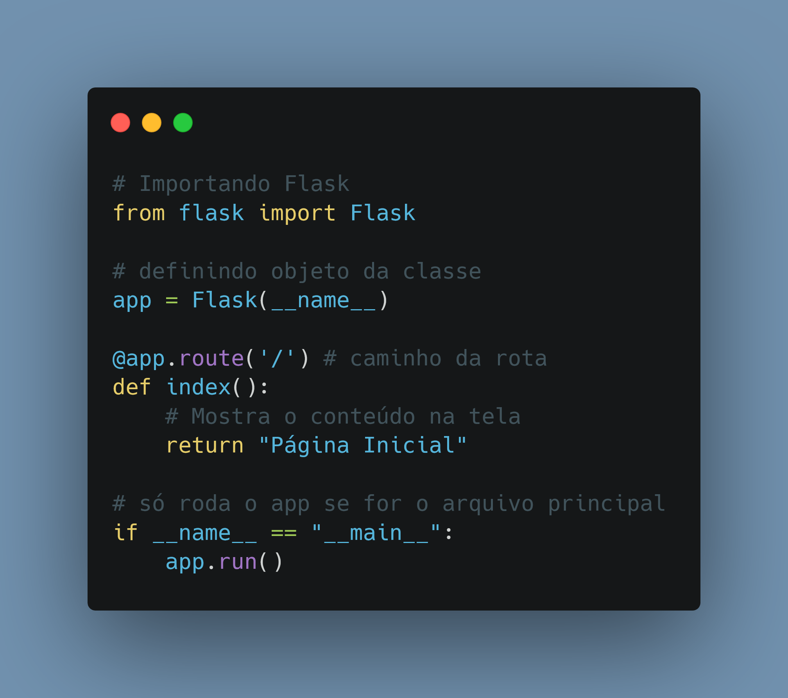

# Dia 11

---
## [Link Linkedin Post](https://www.linkedin.com/posts/lucasnunesdeassis_python-networking-data-activity-6792566990348386304-nHBJ)
---
---
## Script Post

🌶️🐍 Como fazer a sua primeira página web com Python de maneira fácil utilizando Flask, neste post eu inicio meus estudos em Flask, que será meu foco esta semana ;).

❓ Flask é um Micro framework web para Python, Sendo amplamente utilizado para criação de sites & REST API.

ℹ️ Link Repositório Estudo: https://github.com/kilerhg/Python-Studies/tree/master/Flask
ℹ️ Link Biblioteca: https://flask.palletsprojects.com/en/1.1.x/

ℹ️ Link Repositório Posts: https://github.com/kilerhg/linkedin_publics
ℹ️ Perfil GitHub: https://github.com/kilerhg
ℹ️ Link Portfólio: https://lucasnunes.me

#python #networking #data #web #flask #developer #studies #starting

---

## Screenshot

