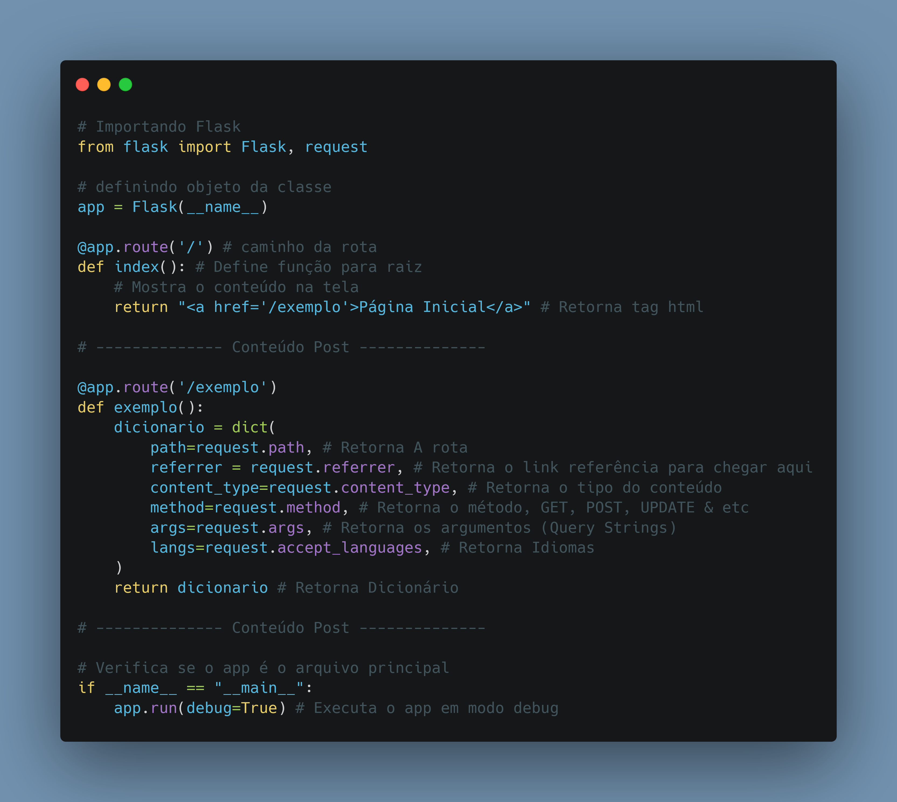

# Dia 12

---
## [Link Linkedin Post](https://www.linkedin.com/posts/lucasnunesdeassis_python-networking-data-activity-6792840964261126145-EwJs)
---
---
## Script Post

🌶️🐍 Como Retornar informações úteis sobre a pagina Python em desenvolvimento utilizando flask.request.

❓ Flask é um Micro framework web para Python, Sendo amplamente utilizado para criação de sites & REST API.

ℹ️ Link Repositório Estudo: https://github.com/kilerhg/Python-Studies/tree/master/Flask

ℹ️ Link Biblioteca: https://flask.palletsprojects.com/en/1.1.x/

ℹ️ Link Repositório Posts: https://github.com/kilerhg/linkedin_publics

ℹ️ Perfil GitHub: https://github.com/kilerhg

ℹ️ Link Portfólio: https://lucasnunes.me

#python #networking #data #web #flask #developer #studies #request

---

## Screenshot

