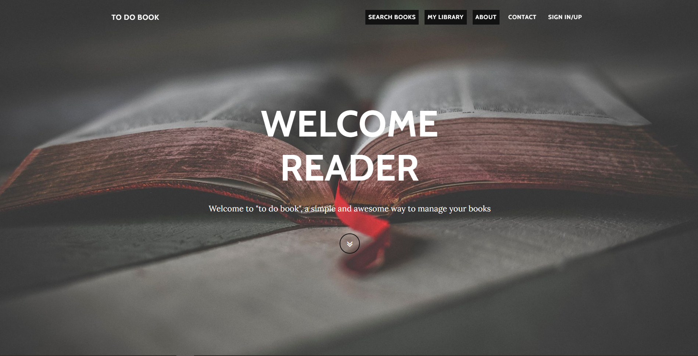

# Dia 14

---
## [Link Linkedin Post](https://www.linkedin.com/posts/lucasnunesdeassis_to-do-book-activity-6848189815603679232-9p-2)
---
---
## Script Post

⏱ Post 1/4

🐍📚 Gestor de Livros WEB Open Source feito em Python, olá ;), hoje venho começar uma 'saga' de posts sobre um projeto que fiz recentemente: "To Do Book" (com a premissa de ser uma maneira simples e eficiente de organizar sua leitura), feito com o framework Flask & banco Postgres. E com deploy no Heroku. Segue o link para o site abaixo & repositório GitHub.

↩️ Post Anterior: https://www.linkedin.com/posts/lucasnunesdeassis_anota%C3%A7%C3%B5es-python-activity-6793313787886878720-auLq

ℹ️ To Do Book: https://apptodobook.herokuapp.com/

ℹ️ Link Repositório : https://github.com/kilerhg/TodoBook

ℹ️ Perfil GitHub: https://github.com/kilerhg

ℹ️ Link Portfólio: https://lucasnunes.me

ℹ️ Link Repositório Posts: https://github.com/kilerhg/linkedin_publics

#python #networking #project #flask #postgres #sql #books #opensource #cloud #github 

---

# Dia 15

---
## [Link Linkedin Post]()
---
---
## Script Post

⏱ Post 2/4

🐍📚 Gestor de Livros em Python, Olá ;), hoje venho continuar a saga do "To Do Book", mostrando sobre login & a busca de livros. se quiser testar o link está logo abaixo ;), e não esqueça do feedback.

↩️ Post Anterior: https://www.linkedin.com/posts/lucasnunesdeassis_to-do-book-activity-6848189815603679232-9p-2

ℹ️ To Do Book: https://apptodobook.herokuapp.com/

ℹ️ Link Repositório : https://github.com/kilerhg/TodoBook

ℹ️ Perfil GitHub: https://github.com/kilerhg

ℹ️ Link Portfólio: https://lucasnunes.me

ℹ️ Link Repositório Posts: https://github.com/kilerhg/linkedin_publics

#python #networking #project #flask #postgres #sql #books #opensource #cloud #github 

---

# Dia 16

---
## [Link Linkedin Post](https://www.linkedin.com/posts/lucasnunesdeassis_to-do-book-activity-6848189815603679232-9p-2)
---
---
## Script Post

⏱ Post 3/4

🐍📚 Gestor de Livros em Python, Olá ;), Demonstrando o lado da biblioteca e gestão de seus livros hoje venho dando continuação na saga de posts do "To Do Book" ;). Se quiser testar o link está logo abaixo ;).

↩️ Post Anterior: https://www.linkedin.com/posts/lucasnunesdeassis_anota%C3%A7%C3%B5es-python-activity-6793313787886878720-auLq

ℹ️ To Do Book: https://apptodobook.herokuapp.com/

ℹ️ Link Repositório : https://github.com/kilerhg/TodoBook

ℹ️ Perfil GitHub: https://github.com/kilerhg

ℹ️ Link Portfólio: https://lucasnunes.me

ℹ️ Link Repositório Posts: https://github.com/kilerhg/linkedin_publics

#python #networking #project #flask #postgres #sql #books #opensource #cloud #github 

---

## Screenshot

