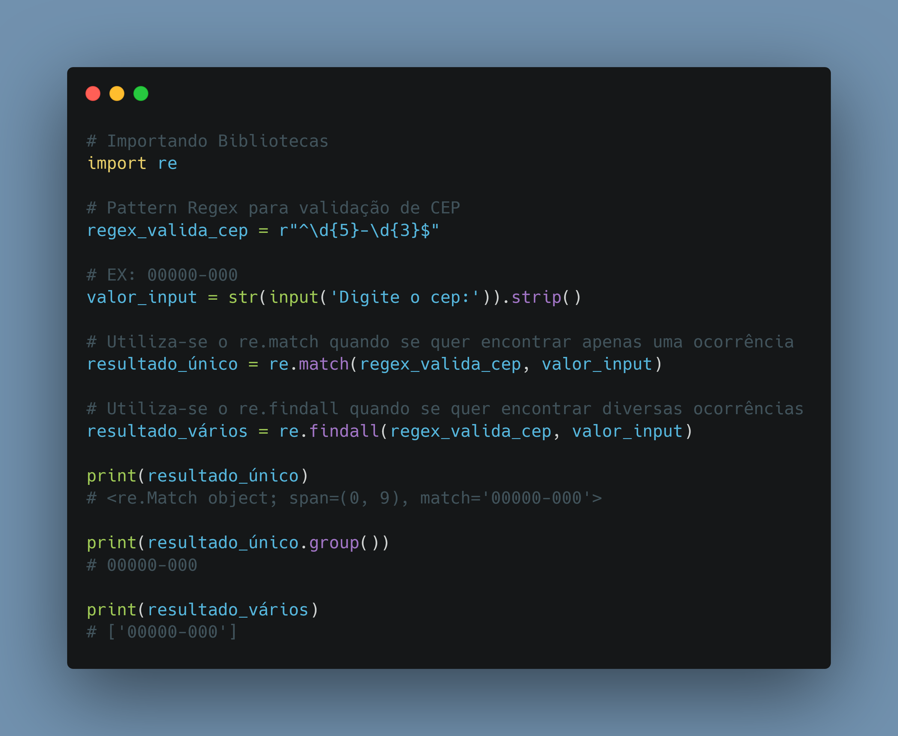

# Dia 17

---
## [Link Linkedin Post](https://www.linkedin.com/posts/lucasnunesdeassis_python-networking-data-activity-6884092030578913280-5gu2)
---
---
## Script Post

✔️ Validador RegEx, Iniciando com validação de strings utilizando RegEx em Python.

❓ RegEx é um método de se encontrar padrões de texto.

ℹ️ Link Repositório: https://github.com/kilerhg/linkedin_publics
ℹ️ Link Biblioteca: https://docs.python.org/3/library/re.html
ℹ️ Link Repositório Biblioteca: https://github.com/python/cpython/blob/3.10/Lib/re.py

ℹ️ Perfil GitHub: https://github.com/kilerhg
ℹ️ Link Portfólio: https://lucasnunes.me

#python #networking #data #RegEx #re

---

## Screenshot

