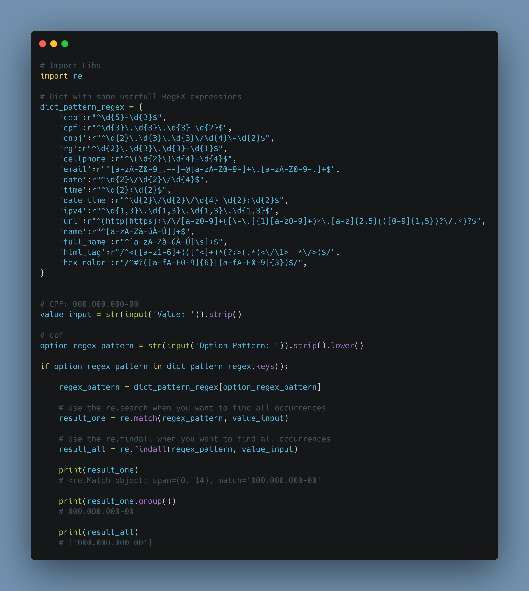

# Dia 18

---
## [Link Linkedin Post]()
---
---
## Script Post

✔️ Awesome and Helpfully RegEX Patterns in a Python Dict!!

❓ RegEx it's a way of finding text patterns

ℹ️ Link Dict: https://github.com/kilerhg/linkedin_publics/Dia_18_mais_sobre_regex/main.py
ℹ️ Link Repository: https://github.com/kilerhg/linkedin_publics/
ℹ️ Perfil GitHub: https://github.com/kilerhg
ℹ️ Link Portfólio: https://lucasnunes.me

#python #networking #data #RegEx #re #Helpfully

---

## Screenshot

