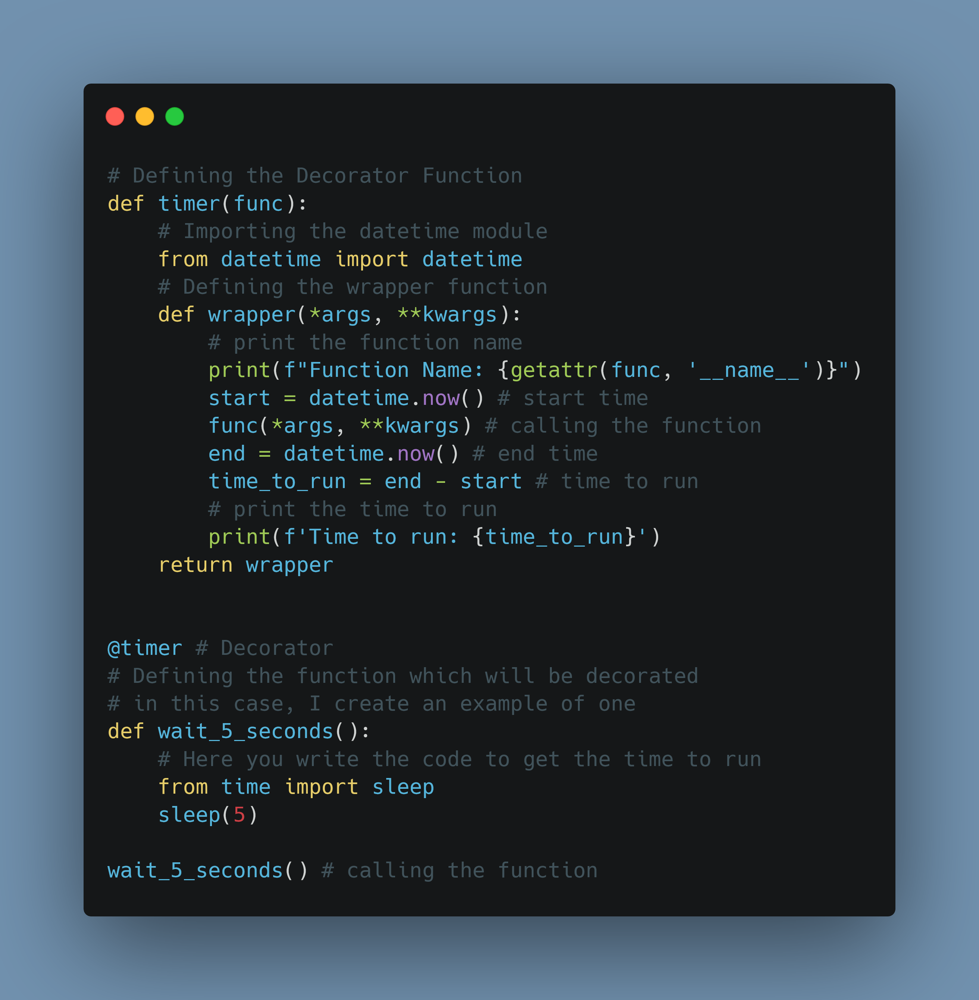

# Dia 19

---
## [Link Linkedin Post](https://www.linkedin.com/posts/lucasnunesdeassis_python-networking-data-activity-6888798230805569536-pulI)
---

---
## Script Post

🐍 How to Create Decorators in python. and an example of a useful one.

❓ Decorator is a way to include a function in other (giving his properties)

ℹ️ Docs: https://pythonguide.readthedocs.io/en/latest/python/decorator.html

ℹ️ Link Repository: https://github.com/kilerhg/linkedin_publics/
ℹ️ Perfil GitHub: https://github.com/kilerhg
ℹ️ Link Portfólio: https://lucasnunes.me

#python #networking #data #Helpfully #decorator

---

## Screenshot

